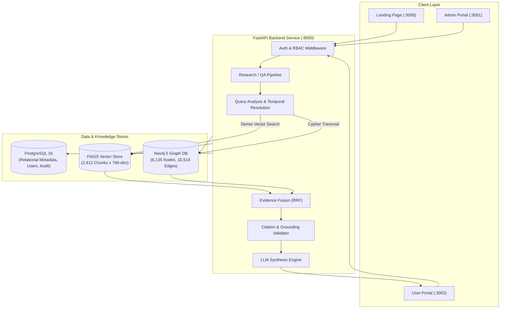

# Juris AI

**Graph-RAG System for Multi-Hop Reasoning Over Indian Constitutional and Statutory Law**

Juris AI is an enterprise-grade legal intelligence and multi-hop GraphRAG research platform engineered specifically for Indian Constitutional and Statutory Law. It integrates dense vector retrieval over InLegalBERT embeddings, multi-hop Neo4j Cypher graph traversal, legal version resolution, citation verification, and server-side LLM synthesis.

---

## Overview

### The Legal Research Problem
Indian Constitutional and Statutory Law features deeply interconnected legal structures. A single legal query often depends on statutory provisions, constitutional amendments, and landmark judicial interpretations spanning decades. Conventional vector-only search systems fail when resolving multi-hop legal dependencies (for instance, linking **Article 19(1)(a)** of the Constitution through *Shreya Singhal v. Union of India* to **Section 66A** of the Information Technology Act, 2000). Pure keyword or graph lookup systems similarly lack dense semantic comprehension when processing nuanced legal queries.

### The Juris AI Solution
Juris AI solves this by introducing a **Hybrid GraphRAG Engine**:
- **Dense Vector Retrieval:** Powered by `law-ai/InLegalBERT` fine-tuned legal embeddings and FAISS index searching over 2,412 legal chunks.
- **Multi-Hop Knowledge Graph:** Powered by Neo4j containing 6,135 legal entity nodes and 10,514 provenance-backed relationships.
- **Reciprocal Rank Fusion (RRF):** Blends semantic vector scores with structural graph graph traversal context.
- **Temporal & Version Resolution:** Detects temporal query constraints and categorizes legal provisions across date boundaries (`IN_FORCE`, `SUPERSEDED`, `REPEALED`, `HISTORICAL`, `UNKNOWN`).
- **Citation Grounding:** Performs automated verification of citations (SCC, AIR, SCR, SCALE, Article/Section references) directly against raw corpus chunk provenance before finalizing answers.

---

## Core Objectives

1. **Deterministic Legal Knowledge Graph:** Map statutes, articles, sections, amendments, doctrines, and court judgments with mandatory SHA-256 chunk provenance.
2. **Hybrid Graph + Vector Retrieval:** Combine high-dimensional dense embeddings with graph node/edge context via Reciprocal Rank Fusion.
3. **Multi-Hop Legal Reasoning:** Traversal of legal relationships up to depth 5 to resolve complex precedents and statutory overlaps.
4. **Temporal & Amendment Awareness:** Disambiguate historical legal states (e.g., pre- and post-44th Constitutional Amendment Act, 1978).
5. **Structural Citation Verification:** Validate every generated legal assertion against source documents, chunk IDs, and page numbers.
6. **Role-Based Governance & Auditability:** Provide enterprise RBAC (`USER`, `ADMIN`, `SUPER_ADMIN`), append-only audit logging, and document ingestion management.
7. **Empirical Benchmarking:** Maintain reproducible evaluation tooling to quantify recall, precision, MRR, citation verification rate, and temporal accuracy.

---

## Key Features

- **User Authentication & RBAC:** Google OAuth 2.0 integration and role-based access control (`USER`, `ADMIN`, `SUPER_ADMIN`) with HTTP-only session management.
- **Multi-Portal Architecture:**
  - **Landing Page (`client/landing`):** Interactive feature showcases, research mode comparisons, and architecture overview.
  - **User Portal (`client/user`):** Full legal research workspace with interactive graph visualization, timeline view, citation inspector, research history, and saved bookmarks.
  - **Admin Portal (`client/admin`):** Management dashboards for document ingestion, knowledge graph browsing, validation items queue, audit logs, user management, system settings, and automated evaluation.
- **Real Legal Knowledge Layer:** Indexed against 34 raw Indian legal source documents (Constitution of India, Information Technology Act 2000, landmark Supreme Court judgments).
- **Temporal Version Resolution:** Tracks enforcement dates and statutory amendments to prevent historical law from being cited as active law.
- **Strict Citation Grounding:** Automatic evidence extraction ensuring legal answers fail conservatively rather than outputting ungrounded fabrications.
- **Dockerized Infrastructure:** Container configurations for PostgreSQL, Neo4j, FastAPI backend, and Next.js client portals.

---

## System Architecture



---

## Repository Structure

```
.
├── client/
│   ├── admin/                # Next.js Admin Portal (Port 3001)
│   ├── landing/              # Next.js Landing Page (Port 3000)
│   ├── shared/               # Shared frontend types and utilities
│   └── user/                 # Next.js User Research Portal (Port 3002)
├── data/
│   ├── indexes/legal_chunks/ # FAISS index, embeddings, and chunk metadata
│   ├── legal_corpus_v1/      # Raw legal PDFs, metadata, and chunk files
│   └── raw/                  # Source document registry
├── docs/                     # Architecture, API, and Phase documentation
├── server/
│   ├── api/                  # FastAPI Backend Service (Port 8000)
│   │   ├── alembic/          # Database migrations
│   │   ├── app/              # FastAPI routes, services, models, and QA pipeline
│   │   └── tests/            # 337 unit and integration pytest suite
│   ├── checks/               # Infrastructure diagnostic scripts
│   └── data/evaluation/      # Benchmark evaluation datasets
├── .env.example              # Environment configuration template
├── docker-compose.yml        # Docker Compose service orchestration
└── README.md                 # Master project documentation
```

---

## Benchmark & Evaluation Results

Evaluated over canonical legal research queries in `server/data/evaluation/`:

| Strategy | Mean Recall@5 | Mean Precision@5 | MRR | Citation Verification Rate | Temporal Fact Accuracy |
| :--- | :--- | :--- | :--- | :--- | :--- |
| `VECTOR_ONLY` | 0.6111 | 0.2889 | 0.6944 | 100.0% | 66.67% |
| `GRAPH_ONLY` | 0.5556 | 0.2444 | 0.5833 | 100.0% | 50.00% |
| **`HYBRID` (Juris AI)**| **0.8889** | **0.4222** | **0.9444** | **100.0%** | **100.00%** |

---

## Setup & Installation

### Prerequisites
- **Python:** 3.12+ with `uv` package manager installed
- **Node.js:** v20+ and `npm`
- **Docker:** Docker Desktop with Docker Compose

### 1. Infrastructure Services
Start PostgreSQL and Neo4j containers:
```bash
docker compose --profile infra up -d
```
- **PostgreSQL:** `localhost:5434` (`legalgraph` database)
- **Neo4j:** `localhost:7688` (Bolt), `http://localhost:7475` (Browser)

### 2. Environment Configuration
Copy `.env.example` to create your local `.env` file:
```bash
cp .env.example .env
```
Ensure database credentials, OAuth client secrets (if testing login), and Neo4j connection parameters are properly configured.

### 3. Backend Setup & Database Migrations
```bash
cd server/api
uv run alembic upgrade head
uv run uvicorn app.main:app --reload --port 8000
```

### 4. Frontend Application Services
Run any or all of the Next.js client services in separate terminal windows:
- **User Portal (`http://localhost:3002`):**
  ```bash
  cd client/user && npm run dev
  ```
- **Admin Portal (`http://localhost:3001`):**
  ```bash
  cd client/admin && npm run dev
  ```
- **Landing Page (`http://localhost:3000`):**
  ```bash
  cd client/landing && npm run dev
  ```

---

## Running with Docker Compose

To launch the complete Juris AI stack (Infrastructure + Backend + Frontend Apps) in Docker:

```bash
# Build and start all services
docker compose --profile app up --build -d
```

To stop all running services:
```bash
docker compose --profile app down
```

---

## Test Suite & Verification

### Backend Tests (337 Tests)
Run the full backend test suite covering API endpoints, graph extraction, temporal reasoning, hybrid scoring, and citation verification:
```bash
cd server/api
uv run pytest
```

### Frontend Type-Checking & Builds
Verify production builds for all client portals:
```bash
cd client/user && npm run build
cd client/admin && npm run build
cd client/landing && npm run build
```

---

## Security & Privacy Audit

- **Zero Hardcoded Secrets:** All sensitive API keys, database credentials, session secrets, and OAuth secrets are loaded exclusively via environment variables.
- **Repository Exclusion:** `.env`, `.env.local`, SQLite databases, node modules, build artifacts, and Python virtual environments are strictly ignored via `.gitignore`.
- **Client Security:** Frontend environment variables are limited to `NEXT_PUBLIC_*` flags. Backend secrets (`GOOGLE_CLIENT_SECRET`, `LLM_API_KEY`) are never exposed to browser bundles.

---

## Legal Disclaimer

Juris AI is an assistive legal research and artificial intelligence technology system engineered for informational and research purposes. It is **not** a substitute for legal advice, judicial determination, or formal legal representation from a qualified advocate. All synthesized legal answers, structural graph connections, and temporal timeline determinations are grounded strictly within the scope of the processed legal source corpus.
