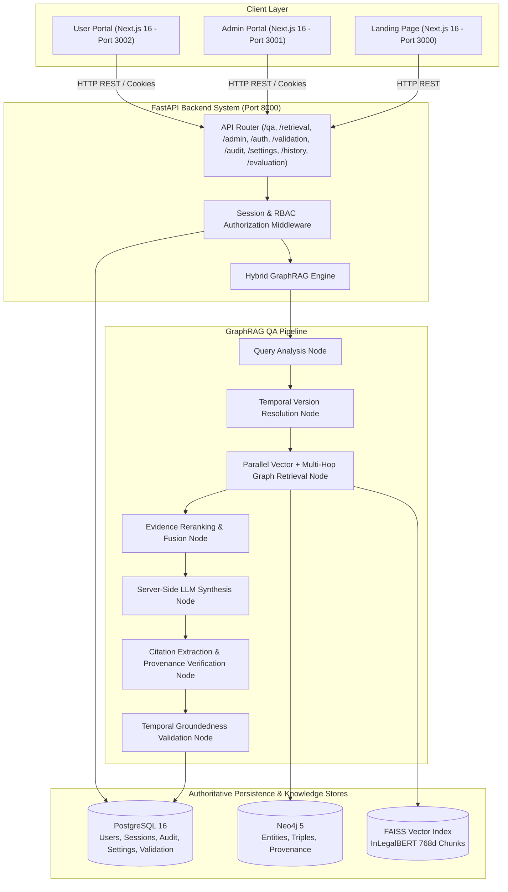

# Juris AI — Final System Architecture & Technical Specification

## 1. High-Level Architecture Overview

Juris AI is an enterprise legal intelligence and multi-hop GraphRAG research platform designed specifically for Indian Constitutional and Statutory Law. It seamlessly combines dense vector search over specialized legal embeddings, multi-hop Neo4j Cypher graph traversal, temporal version resolution, structural legal citation verification, and server-side LLM synthesis.

---

## 2. Core Subsystems

### A. Real Legal Knowledge Layer (Phase 13)
- **PDF Processing:** 34 raw Indian legal PDFs (Constitution of India, IT Act 2000, landmark Supreme Court judgments).
- **Chunking & Vector Indexing:** 2,412 legal chunks embedded via `law-ai/InLegalBERT` into a 768-dimensional `FAISS IndexFlatIP` index.
- **Neo4j Graph Database:** 6,135 unique legal entities and 10,514 provenance-backed relationships storing source document ID, chunk ID, page number, evidence text, and SHA-256 provenance fingerprint.

### B. Hybrid GraphRAG & Multi-Hop Reasoning (Phase 14)
- **Parallel Retrieval:** Combines FAISS dense vector search with multi-hop Neo4j Cypher graph traversal (default depth 3, max 5).
- **Reciprocal Rank Fusion (RRF):** Fuses dense vector scores and graph proximity scores into a unified hybrid relevance ranking.

### C. Temporal Reasoning & Citation Grounding (Phase 15)
- **Temporal Analysis:** Detects date bounds, explicit target years, and temporal operators (`BEFORE`, `AFTER`, `SINCE`, `UNTIL`, `HISTORICAL`, `CURRENT_LAW`).
- **Legal Version Resolution:** Resolves entity versions against canonical milestones (`IN_FORCE`, `SUPERSEDED`, `REPEALED`, `HISTORICAL`, `UNKNOWN`).
- **Citation Verification:** Regex pattern matching for SCC, AIR, SCR, SCALE, Article/Section citations. Verifies evidence provenance against raw corpus chunks.

### D. Admin Backend, Persistence & Evaluation (Phase 16)
- **PostgreSQL Store:** Authoritative storage for Users, User Roles (`user`, `admin`, `super_admin`), System Settings, Audit Events, Validation Items, Research History, and Saved Bookmarks.
- **Reproducible Evaluation Framework:** Dataset in `server/data/evaluation/` evaluating `VECTOR_ONLY`, `GRAPH_ONLY`, and `HYBRID` strategies on Recall@K, Precision@K, MRR, Citation Verification Rate, and Temporal Accuracy.

---

## 3. Technology Stack

- **Backend:** Python 3.12, FastAPI, SQLAlchemy 2.0 (Async), Alembic, Pydantic v2, FAISS-CPU, SentenceTransformers, Neo4j Async Driver, Uvicorn.
- **Frontend:** Next.js 16 (Turbopack), TypeScript, TailwindCSS, React 19, Lucide Icons.
- **Databases:** PostgreSQL 16 (Relational/Metadata), Neo4j 5 Community (Graph).
- **Deployment:** Docker, Docker Compose.
